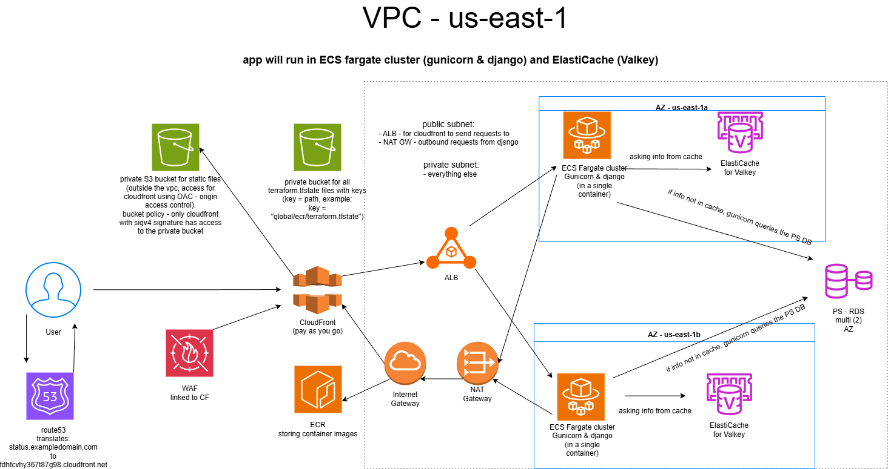

# ST Status Page: AWS Infrastructure


## Introduction
Welcome to the ST Status Page project! This repository houses the Infrastructure as Code (IaC) written in **Terraform** to deploy a complete, highly available, and secure AWS cloud environment. 

Our architecture is designed to run a containerized application using **Amazon ECS**, sitting behind an **Application Load Balancer (ALB)**, connected to a managed **Database**, and routed via **DNS**. The project is structured to support multiple environments (`dev`, `stage`, `prod`) using reusable Terraform modules.

## Architecture Overview


### Core Modules
To keep our code clean and reusable, our infrastructure is divided into the following modules:
* **Networking**: Provisions the VPC, subnets, and routing.
* **Security**: Manages Identity and Access Management (IAM) roles and Security Groups.
* **ALB**: Sets up the Application Load Balancer to distribute traffic.
* **ECS**: Configures the Elastic Container Service cluster and task definitions.
* **Database**: Provisions the managed database layer.
* **Frontend**: Manages the static assets or frontend application hosting.
* **DNS**: Manages Route53 hosted zones and records.

### Global Resources
Some resources are shared across all environments:
* **S3 Backend**: Stores our Terraform state securely.
* **ECR**: Elastic Container Registry to store our Docker images.
* **GitHub OIDC**: Allows GitHub Actions pipelines to securely deploy to AWS without hardcoding long-lived access keys.

## Prerequisites
To work with this repository locally, you need the following tools installed:
* [Terraform](https://www.terraform.io/downloads.html) (v1.x+)
* [AWS CLI](https://aws.amazon.com/cli/) configured with proper access rights (`aws configure`)
* [Git](https://git-scm.com/)

## Repository Structure
We follow a standard Terraform directory layout:
```text
terraform/
├── environments/          # Environment-specific configurations
│   ├── dev/               # Development environment
│   ├── stage/             # Staging environment
│   └── prod/              # Production environment
├── global/                # Resources shared across all environments
│   ├── ecr/               # Docker image registries
│   ├── github_oidc/       # CI/CD authentication
│   └── s3-backend/        # Remote state storage
└── modules/               # Reusable infrastructure code
    ├── alb/
    ├── database/
    ├── dns/
    ├── ecs/
    ├── frontend/
    ├── networking/
    └── security/
```

## Getting Started
### Step 1: Initialize Global Resources
Before deploying any environments, you must set up the global infrastructure (in the following order):

- global/s3-backend
- global/ecr & global/github_oidc
- environments/dev
- environments/stage
- environments/prod

regarding global/s3-backend:
the backend configuration is currently wrapped in /* ... */ comments. Leave it commented out.
Run terraform init and then terraform apply in the global/s3-backend folder. Terraform will create the bucket and DynamoDB table in AWS, and it will temporarily save the .tfstate file locally on your laptop.
Once the resources are created, remove the /* and */ comments from backend.tf & Run terraform init again. Terraform will notice the change and ask: "Do you want to copy your local state into the new S3 bucket?". Type yes.

**relevant commands:**
- `terraform init`
- `terraform validate`
- `terraform plan`
- `terraform apply`


### Step 2: Cleanup
**order of destruction (`terraform destroy`):**
- environments/prod
- environments/stage
- environments/dev
- global/ecr & global/github_oidc
- global/s3-backend

### **FYI**
You should never run terraform init, plan, apply, or destroy directly inside the modules directory.
- Modules are Blueprints: The folders inside modules/ (like networking, alb, database) are just reusable templates or blueprints. They define how a VPC or an Application Load Balancer should be built, but they don't specify where or for which environment.
- Environments are the Builders: Your environments (environments/dev, environments/prod, etc.) are the actual implementations. If you look at environments/dev/main.tf, you will see that it "calls" the modules and passes specific variables to them (like telling the networking module to use a specific vpc_cidr for Dev).


